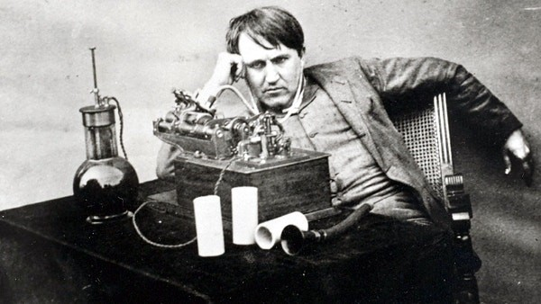
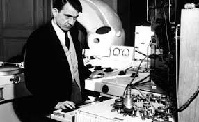
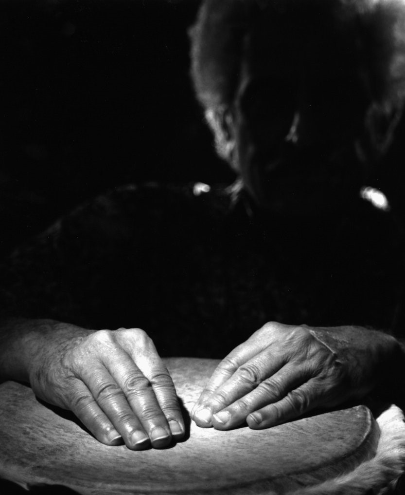
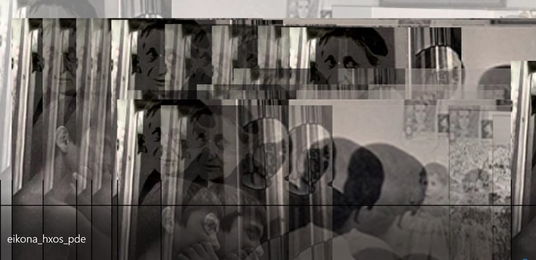

# Για τον Christoph Cox. Από την Τεχνική του Ήχου στην Τέχνη των Θορύβων;

 ΓΙΩΤΑ ΑΝΔΡΙΑΚΑΙΝΑ 

   

 <b> Για τον Christoph Cox.  
Από την Τεχνική του Ήχου στην Τέχνη των Θορύβων;    
</b>     
 <b> Steve Reich, Clapping Music, 1972 </b>        
<b> Πρόλογος –  Η Διάλεξη του κου Christoph Cox.
 Μια διάλεξη για τον Ήχο με πολύ κακό ήχο[[1]] </b>

 

Στόχος αυτής της εργασίας, η οποία ανατέθηκε στο πλαίσιο του μαθήματος «Διαδραστικός Ηχητικός Σχεδιασμός», είναι να στρέψει το ενδιαφέρον μας στη φιλοσοφία και την αισθητική του ήχου.  

Τον Ιανουάριο του 2017, ο Christoph Cox, καθηγητής φιλοσοφίας με γνωστικό αντικείμενο την ιστορία της τέχνης και τις πολιτισμικές σπουδές, έδωσε μια διάλεξη σε ένα από τα πιο διάσημα μουσεία της Αμερικής, στην Collection Gallery - Barnes Foundation που βρίσκεται στην πολιτεία της Φιλαδέλφειας.  

Η διάλεξη του Cox, καθηγητή στο Hampshire College της Μασαχουσέτης, έχει τον τίτλο A Brief History of Sound Art, ο οποίος θα μπορούσε να αποδοθεί στα ελληνικά ως εξής, Τέχνη του Ήχου, Μια Σύντομη Ιστορία.  

  
 <b>Christoph Cox makes sounds [lectures]  </b>                                       

Από την μακροσκελή διάλεξη του Cox, συνολικής διάρκειας σχεδόν δύο  ωρών, θα σας παρουσιάσω εδώ ένα μικρό απόσπασμα, αυτό που μου ζητήθηκε να αναλύσω, το οποίο βρίσκεται στο διάστημα 11:40-19:40.  

Ωστόσο, για να κατανοήσει κανείς το μικρό απόσπασμα από τη διάλεξη  θα πρέπει να έχει ως πλαίσιο το σύνολό της, και ίσως, για να καταφέρει μια εμβάθυνση στο αντικείμενο, θα πρέπει να έχει μια γνώση των έργων και των δημιουργών τους οποίους ο Cox αναφέρει και παραπέμπει στην ομιλία του.  

Όπως και νάχει όμως, ακόμα και στον πιο αδαή με το σχετικά νέο γνωστικό πεδίο, την ιστορία του ήχου, η διάλεξη του αμερικανού καθηγητή υπόσχεται διότι εξάπτει την φαντασία και προσφέρει κίνητρα για περαιτέρω ενασχόληση και μελέτη.  

   

<b> Ο Cox για τη Συγκεκριμένη Μουσική.
Aπό τον Luigi Russolo στον Halim El-Dabh
 </b>

  
Ο Cox αναφέρεται, μεταξύ πολλών άλλων, στον Luigi Russolo (1885-1947),  Iταλό ζωγράφο, μουσικό και πρωτοπόρο του φουτουρισμού, και παραθέτει ένα απόσπασμα από το βιβλίο του Η Τέχνη των Θορύβων [L’ arte dei Rumori / The Art of Noises, 1913]. Πρόκειται για ένα φουτουριστικό μανιφέστο με το οποίο ο Russolo εγκαινιάζει έναν στοχασμό πάνω στην εικαστική αξιοποίηση των ήχων της μοντέρνας βιομηχανικής πόλης και θεωρεί τη σχέση ανάμεσα στην τέχνη και την τεχνολογία.  

Ο Russolo ήταν ένας φουτουριστής [Cox, video, 10.45 min]. Και όπως θα γνωρίζετε, οι φουτουριστές …. είχαν μια  τάση προς τα μανιφέστα, τις διακηρύξεις μεγάλης κλίμακας, και έτειναν να υποβιβάζουν οτιδήποτε ανήκει στο παρελθόν. Για αυτούς, το παρελθόν δεν είναι τίποτα άλλο παρά ο σκουπιδοτενεκές της ιστορίας [Cox, video, 10.48 min]. [[2]]  

Από αυτή τη σκοπιά, ο Russolo σημείωνε ότι σήμερα, στον σύγχρονο κόσμο, η ορχήστρα είναι άχρηστη, τα μουσικά όργανα είναι άχρηστα, διότι τώρα χρειαζόμαστε μια νέα μορφή τέχνης, την τέχνη των θορύβων - και χρειαζόμαστε νέα όργανα για να πραγματοποιηθεί κάτι τέτοιο (εννοεί, κάτι τόσο επαναστατικό που να διαγράφει συλλήβδην όλο το παρελθόν) [Cox, video, 11.07 min]

Ο Cox παραθέτει στη συνέχεια ένα σχετικά μεγάλο απόσπασμα από το κείμενο-μανιφέστο του Russolo, το οποίο σε ελεύθερη απόδοση πηγαίνει κάπως έτσι:  

«Ο μουσικός ήχος είναι πολύ περιορισμένος όσον αφορά την ποικιλία των ηχοχρωμάτων [variety of timbres]. Πρέπει να ξεφύγουμε, να απελευθερωθούμε από αυτόν τον στενό, περιορισμένο κύκλο ήχων και να κατακτήσουμε την άπειρη ποικιλία των ήχων, των ήχων του θορύβου [….]. Σας προσκαλώ να  πειραματιστούμε διασχίζοντας μια μεγάλη, σύγχρονη πόλη με τα αυτιά μας σε εγρήγορση,  με την ακοή μας να είναι πιο ευαίσθητη από την όραση.  

Εάν το κάνουμε, θα απολαύσουμε και θα γοητευθούμε από τους ήχους, από την περιδίνηση του νερού, του αέρα  και του   γκαζιού μέσα στους μεταλλικούς σωλήνες, από το μουρμουρητό των μοτέρ, την ξέφρενη αναπνοή τους, τον παλμό και την αδιαμφισβήτητα ζωώδη ενέργειά τους, από τον ρυθμό, το έντονο καρδιοχτύπι, των βαλβίδων, και από τη διέγερση που προκαλούν οι παλινδρομικές κινήσεις των μηχανικών εμβόλων, από τις στριγκές φωνές, τις κραυγές, των πριονιών, από τον ήχο που βγάζει η εκκίνηση των τραμ πάνω στις ράγες, από το κροτάλισμα ενός μαστίγιου, από το ράπισμα και το φτερούγισμα μιας σημαίας ή μιας υφασμάτινης τέντας.   

΄Ετσι θα διασκεδάσουμε λοιπόν και θα ψυχαγωγηθούμε ενορχηστρώνοντας στη φαντασία μας ετερόκλητους ήχους,  τα κυλιόμενα ρολά των καταστημάτων την ώρα που κλείνουν, τη βαβούρα των ετερόκλητων ήχων στους πολύβουους σιδηροδρομικούς σταθμούς, στα σιδηρουργεία, τα ελαιοτριβεία, τα πιεστήρια, τα ηλεκτρικά εργοστάσια και τα μετρό».

Όλες αυτές οι ιδέες -δηλαδή, ότι οι αστικοί ήχοι, οι ήχοι της πόλης, θα μπορούσαν να ακουστούν αισθητικά, ότι παρότι κανένας από αυτούς τους ήχους δεν ανήκει στο πεδίο της αισθητικής, θα πρέπει να αποτελέσουν μέρος της αισθητικής πράξης, και ότι θα πρέπει να ακουστεί και να αναδειχτεί η αισθητική τους διάσταση και ποιότητα – ναι, αυτές είναι οι βασικές ιδέες του Russolo που συνοψίζουν την παρέμβασή του και την πρωτοτυπία της. 

Σύμφωνα με τον Russolo τα αυτιά μας λαχταρούν τώρα περισσότερους θορύβους. Από τη δική του σκοπιά, όλοι οι ήχοι του παρελθόντος, με αυτήν την γλυκύτητα, είναι πολύ νοσηροί, ασθενικοί. Βέβαια, αν αυτό αληθεύει ή όχι, είναι μια καλή ερώτηση, αλλά είναι άλλο ζήτημα, δεν εξετάζουμε αυτό το ζήτημα σήμερα [12.23].   

Παρά το γεγονός ότι ο Edison το 1878 εφευρίσκει τη μηχανή ηχογράφησης, αυτή δεν ήταν ευρέως διαθέσιμη, δεν είχε κυκλοφορήσει στο εμπόριο, και σίγουρα αυτό που αναζητούσε ο Rossolo το 1913 δεν ήταν φυσικά ένα μαγνητόφωνο [12.48]  

  
##### Thomas Edison in his lab in 1888, after working long hours on his phonograph.[[3]] 

Έτσι ξεκίνησε να το ψάχνει και να κατασκευάζει μια ορχήστρα οργάνων, την οποία ονόμασε Intorno Rumori. Το όνομα ήταν intonarumori…… θόρυβο-τονιστής …… Και έτσι έφτιαξε τη μουσική του την οποία ακόμα θεωρούμε ως τη δική του, κατά κάποιο τρόπο, μουσική, και εδώ είναι ένα σύντομο κλιπ  - ακούστε ένα δείγμα αυτής της δουλειάς –

[ακούγονται ήχοι από το Intorno Rumori…]

Αυτή η ηχογράφηση είναι πρόσφατη. Η αρχική καταστράφηκε σε πυρκαγιά. Πρόκειται για μια πρόσφατη ηχογράφηση ενός μόνο μικρού θραύσματος, από το Russolo intonarumori , 1913 [13.42]

Λίγο μετά το μανιφέστο του Russolo η πολιτιστική γοητεία που ασκούσε ο θόρυβος επεκτάθηκε από τους φουτουριστές καλλιτέχνες και στην ποίηση. Μιλάω για κάποιους ποιητές, για όσους επιχείρησαν να εξαλείψουν το νόημα προς όφελος των καθαρά ηχητικών αξιών.  [15.7]

Θα παίξω εδώ ένα σύντομο απόσπασμα από ένα διάσημο έργο  - το Ursonate (1922-32) του Kurt Switters. 

[ακούγονται  ήχοι από το έργο του Kurt Switters…].[[4]]

  
<b>Kurt Schwitters, Super-Bird-Song[[5]]</b>

Η πρωτότυπη ηχογράφηση από τον ίδιο τον Switters  είναι κακή, αυτή που ακούσαμε είναι από έναν σύγχρονο ηχητικό καλλιτέχνη, τον Christian Bok.

Αυτή η έγνοια για τον ήχο, η αναγωγή της γλώσσας στα πρωταρχικά της συστατικά, στη φωνή, στους ήχους, ήταν χαρακτηριστική για ένα σύνολο καλλιτεχνών – για τους  λετρίστες (lettrists, κίνημα διανοούμενων – 1940s -1950s, Γαλλία,  Isidore Isu, Guy Debord), αλλά και για τον Bob Kuban  και για τους σύγχρονους ηχητικούς καλλιτέχνες, όπως η  Chrissie Morris and ο Christian Bok [εδώ γίνεται αναφορά και σε άλλα ονόματα και κινήματα, τα οποία όμως δεν βγαίνουν καθαρά].

Πρέπει λοιπόν να σκεφτούμε τον θόρυβο και τον ήχο έναντι/αντί της γλώσσας. 

Όταν τα μαγνητόφωνα [16.56] άρχισαν να γίνονται πιο εμπορικά, και να κυκλοφορούν στην αγορά διαθέσιμα στις φορητά μαγνητόφωνα – κάπου τη δεκαετία του 40, οι ηχητικοί καλλιτέχνες αρχίζουν να συνειδητοποιούν και να ξανασκέφτονται το όραμα του  Rossolo, το όραμα του θορύβου – τον θόρυβο ως κατηγορία,  τη φύση του θορύβου.

Σε αυτή την κατεύθυνση, η πιο διάσημη δουλειά του είναι η ηχογράφηση των ήχων από τραίνα η οποία έγινε στο Παρίσι. 

Εδώ σας παρουσιάζω ένα μικρό κομμάτι αυτής της δουλειάς, Pierre Schaeffer at GRM Studio Paris 1951 

Ο Schaeffer ονόμασε τη σύνθεσή του «συγκεκριμένη μουσική»  για να την ξεχωρίσει από την ορχηστρική μουσική την οποία αποκαλούσε «αφηρημένη μουσική». Την ονόμαζε «αφηρημένη», σε αντίθεση με τη δική του, τη συγκεριμένη, επειδή η ορχηστρική μουσική περνούσε μέσα από πολλές διαμεσολαβήσεις, δεν ήταν άμεση, λοξοδρομούσε, περνούσε μέσα από την παράκαμψη και την παρέμβαση του συνθέτη, και τις σημειώσεις του, δηλαδή την απόδοσή της με γραφικά σύμβολα και νότες, και μετά περνούσε στους μουσικούς που επιτελούσαν το κομμάτι .. Διαφορετικά ήταν τα πράγματα στην μουσική του Schaeffer – ήταν συγκεκριμένα και όχι αφηρημένα. Η μουσική του, υποστήριζε, λαμβάνει πράγματα και ήχους που υπάρχουν ήδη μέσα στον κόσμο και απλώς τα επεξεργάζεται σε μια πιο καθαρή μορφή, αυτός ήταν για τον Schaeffer ο συγκεκριμένος τρόπος να κάνεις/δημιουργείς μουσική.

  
 <b> Pierre Schaeffer[[6]] </b>

Ο Schaeffer υπήρξε βέβαια μια σημαντική, εμβληματική καλλιτεχνική φιγούρα, άσκησε σημαντική επιρροή στους ευρωπαίους συνθέτες, πολλοί από αυτούς συνέρρεαν  στο στούντιό του, ήταν ένας αναγνωρισμένος πρωτοπόρος της μουσικής [όλη αυτή η πρόταση βγαίνει με ιδιαίτερη δυσκολία, μάλλον κάτι τέτοιο λέει]

Ωστόσο, μερικά χρόνια ενωρίτερα από την δουλειά του Schaeffer , έχουμε έναν συνθέτη από την Αίγυπτο, τον  Halim El-Dabh ο οποίος άρχισε να συνθέτει σε ένα συρμάτινο μαγνητόφωνο [wire radio recorder] που είχε αγοράσει από το Κάιρο, ένα κομμάτι,  ένα σύντομο κομμάτι που ονομάζεται, Η Έκφραση του Zaar (The Expression of Zaar, 1944). 

Πρόκειται για γυναικείες φωνές  που φιλτράρονται με διαφορετικούς τρόπους. Θα σας δείξω ένα μικρό κομμάτι από το Zaar  [μια αρχαία τελετουργία που τελείται δημόσια και στοχεύει στον εξορκισμό], του οποίου η εγγραφή έγινε στην «παραδοσιακή Αφρική» - παραδοσιακή Αφρική είναι οι όροι που χρησιμοποιεί ο Halim El-Dabh-.

  
 <b> Halim El-Dabh Drumming Workshop [[7]] </b>

Πέντε  σημεία της διάλεξης με αναφορά σε καλλιτέχνες, καλλιτεχνικά κινήματα, ιδέες/ έννοιες –εικαστική εφαρμογή (Εργασία με τίτλο: Ear,   The Temple where Otherness is Welcomed, Τranslated , Understood or Misunderstood)

Ζυρίχη,1916-1922 [[8]] .Εκεί ξεκινάει το  dada που δύσκολα θα μπορούσε να χαρακτηριστεί σαν κίνημα ή σαν μια καλλιτεχνική τάση επειδή δεν είχε κάποιες ξεκάθαρες προσδιορισμένες αρχές. Όταν ρωτούσαν τους Hugo Ball ,Marcel Duchamp και   Kurt Schwitters τι είναι dada απαντούσαν :το dada είναι μια κατάσταση του πνεύματος , με πρόθεση να σοκάρουν. Πίστευαν ότι η λογική είχε εγκαταλειφθεί από την ανθρωπότητα κι ότι όποιος έπαιρνε τη ζωή στα σοβαρά  ήταν ξεγραμμένος. Τάχθηκαν κατά του πολέμου. Διακήρυτταν  τον «απόλυτο» παραλογισμό σαν όπλο ενάντια στη λογική του πολέμου.
1. [16.56]  Το πραγματικό ενδιαφέρον των ντανταϊστών  για τη μουσική εκδηλωνόταν μόνο όταν αυτή υπηρετούσε άλλες μορφές τέχνης.Σ΄αυτές τις λειτουργίες , η μουσική μπορούσε να υπάρχει και χωρίς τη σταθερή τονικότητα, που μέχρι τότε ήταν ένα βασικό στοιχείο της δομής της. Με την κατάργηση της τονικότητας δηλαδή των μουσικών ήχων, το μόνο που απέμενε ήταν ένας ρυθμικός θόρυβος .
2. [15.7] Ο ιδρυτής του νταντά , Hugo Ball [[9]] έφτασε στο «ηχοποίημα» την διαδοχή συλλαβών δίχως νόημα ή περιεχόμενο ,απαλλαγμένων από συμβολικά νοήματα ,τίποτα περισσότερο από ακουστικό υλικό. Να πως ήταν περίπου ένα από αυτά τα ηχο-ποιήματα:
Γκάτζι μπέρι μπίμπα 
Γκλαντριντί λαουλί λόνι καντόρι
Γκατζάμα μπιμ μπέρι γκλασάλα 
Γκλαντριντί γκλασάλα τουφφμ ι σιμπραμπίμ
Μπλάσα γκαλασάσα τουφφμ ι σιμπραμπίμ 
3. [16.56] Bruit = ο θόρυβος .Είναι χαρακτηριστική η ερμηνεία που δίνει το “Petit Larousse” για μια λέξη που χρησιμοποίησαν οι ντανταϊστές στη μουσική Bruit =συνονθύλευμα διαφόρων ήχων ,όπου λείπει η οποιαδήποτε αρμονία.
4. [13.42] Το έργο του Γερμανού καλλιτέχνη Kurt Schwitters με τίτλο Opened by Customs-1937–8  θα μπορούσε να περιγραφεί ως θραύσματα από μεταχειρισμένο χαρτί,τυπωμένο χαρτί, χρώμα λαδιού και γραφίτη. Ο ίδιος αναφέρει New things had to be made out of fragments.
5. Όλα τα παραπάνω συνοψίζονται στην εργασία μου με τίτλο Ear,  The Temple where Otherness is Welcomed, Τranslated , Understood or Misunderstood.Το νόημα και η αλλοίωση του νοήματος, η έννοια του θραύσματος και του θορύβου, ο ρυθμικός θόρυβος. 

Στην εργασία μου με την οποία ασχολούμαι από τις αρχές του εξαμήνου, αρχικά αναζήτησα  μια αφηγηματική πλοκή με αρχή, μέση και τέλος που δημιουργείται από ένα σύνολο ανθρώπων. Πρόκειται για προφορικές αφηγήσεις που αφορούν μνήμες και αναμνήσεις, τις ιστορίες κατοίκων της Καλαμαριάς και της Τούμπας που ήρθαν στη Θεσσαλονίκη ως πρόσφυγες από τον Πόντο το 1921.
Η εργασία μου υλοποιήθηκε  με την γλώσσα προγραμματισμού processing και είναι διαδραστική με εικόνα –collage και ήχο . Ο θεατής μπορεί να επιλέξει με τη βοήθεια του mouse του υπολογιστή,  να αναδιαμορφώνει  την εικόνα σε αλλεπάλληλα  νέα collages-layers , με θραυσματική μορφολογία. Κατά πλάτος της εικόνας υπάρχει   μια  οριζόντια μαύρη γραμμή  που λειτουργεί σαν τη γραμμή του χρόνου, το timeline στα προγράμματα επεξεργασίας  ήχου και η κάθετη μαύρη γραμμή με την βοήθεια της γλώσσας προγραμματισμού processing, δίνει τη δυνατότητα στο θεατή ,μέσω της διάδρασης να επιλέξει το  στιγμιότυπο του ηχητικού  αρχείου που θα ακούσει. Μπορεί ο θεατής να το ακούσει απαράλλακτο όπως δημιουργήθηκε με το πρόγραμμα Adobe Audition ,Paul Stretch, Hour Glass,Sound Grain με ένα χαλί ήχων από ηχογαβάθες, γκονγκ, ήχους που χρησιμοποιούνται στο Θιβέτ   ή να το παραμορφώσει ολότελα, έτσι ώστε να είναι αδύνατον να ακουστεί και μα μετατραπεί σε θόρυβο. Παρακαλώ πολύ να γίνει δεκτή και η εργασία με τίτλο Ear,   The Temple where Otherness is Welcomed, Τranslated , Understood or Misunderstood.

  
 <h6>Γιώτα Ανδριάκαινα -2020 </h6>

 
