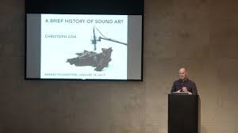

# Για τον Christoph Cox. Από την Τεχνική του Ήχου στην Τέχνη των Θορύβων;

 ΓΙΩΤΑ ΑΝΔΡΙΑΚΑΙΝΑ 

   

 <b> Για τον Christoph Cox.  
Από την Τεχνική του Ήχου στην Τέχνη των Θορύβων;    
</b>     
 <b> Steve Reich, Clapping Music, 1972 </b>        
<b> Πρόλογος –  Η Διάλεξη του κου Christoph Cox.
 Μια διάλεξη για τον Ήχο με πολύ κακό ήχο[[1]] </b>

 

Στόχος αυτής της εργασίας, η οποία ανατέθηκε στο πλαίσιο του μαθήματος «Διαδραστικός Ηχητικός Σχεδιασμός», είναι να στρέψει το ενδιαφέρον μας στη φιλοσοφία και την αισθητική του ήχου.  

Τον Ιανουάριο του 2017, ο Christoph Cox, καθηγητής φιλοσοφίας με γνωστικό αντικείμενο την ιστορία της τέχνης και τις πολιτισμικές σπουδές, έδωσε μια διάλεξη σε ένα από τα πιο διάσημα μουσεία της Αμερικής, στην Collection Gallery - Barnes Foundation που βρίσκεται στην πολιτεία της Φιλαδέλφειας.  

Η διάλεξη του Cox, καθηγητή στο Hampshire College της Μασαχουσέτης, έχει τον τίτλο A Brief History of Sound Art, ο οποίος θα μπορούσε να αποδοθεί στα ελληνικά ως εξής, Τέχνη του Ήχου, Μια Σύντομη Ιστορία.  

  
 <b>Christoph Cox makes sounds [lectures]  </b>                                       

Από την μακροσκελή διάλεξη του Cox, συνολικής διάρκειας σχεδόν δύο  ωρών, θα σας παρουσιάσω εδώ ένα μικρό απόσπασμα, αυτό που μου ζητήθηκε να αναλύσω, το οποίο βρίσκεται στο διάστημα 11:40-19:40.  

Ωστόσο, για να κατανοήσει κανείς το μικρό απόσπασμα από τη διάλεξη  θα πρέπει να έχει ως πλαίσιο το σύνολό της, και ίσως, για να καταφέρει μια εμβάθυνση στο αντικείμενο, θα πρέπει να έχει μια γνώση των έργων και των δημιουργών τους οποίους ο Cox αναφέρει και παραπέμπει στην ομιλία του.  

Όπως και νάχει όμως, ακόμα και στον πιο αδαή με το σχετικά νέο γνωστικό πεδίο, την ιστορία του ήχου, η διάλεξη του αμερικανού καθηγητή υπόσχεται διότι εξάπτει την φαντασία και προσφέρει κίνητρα για περαιτέρω ενασχόληση και μελέτη.  

   

<b> Ο Cox για τη Συγκεκριμένη Μουσική.
Aπό τον Luigi Russolo στον Halim El-Dabh
 </b>

  
Ο Cox αναφέρεται, μεταξύ πολλών άλλων, στον Luigi Russolo (1885-1947),  Iταλό ζωγράφο, μουσικό και πρωτοπόρο του φουτουρισμού, και παραθέτει ένα απόσπασμα από το βιβλίο του Η Τέχνη των Θορύβων [L’ arte dei Rumori / The Art of Noises, 1913]. Πρόκειται για ένα φουτουριστικό μανιφέστο με το οποίο ο Russolo εγκαινιάζει έναν στοχασμό πάνω στην εικαστική αξιοποίηση των ήχων της μοντέρνας βιομηχανικής πόλης και θεωρεί τη σχέση ανάμεσα στην τέχνη και την τεχνολογία.  

Ο Russolo ήταν ένας φουτουριστής [Cox, video, 10.45 min]. Και όπως θα γνωρίζετε, οι φουτουριστές …. είχαν μια  τάση προς τα μανιφέστα, τις διακηρύξεις μεγάλης κλίμακας, και έτειναν να υποβιβάζουν οτιδήποτε ανήκει στο παρελθόν. Για αυτούς, το παρελθόν δεν είναι τίποτα άλλο παρά ο σκουπιδοτενεκές της ιστορίας [Cox, video, 10.48 min]. [[2]]  

Από αυτή τη σκοπιά, ο Russolo σημείωνε ότι σήμερα, στον σύγχρονο κόσμο, η ορχήστρα είναι άχρηστη, τα μουσικά όργανα είναι άχρηστα, διότι τώρα χρειαζόμαστε μια νέα μορφή τέχνης, την τέχνη των θορύβων - και χρειαζόμαστε νέα όργανα για να πραγματοποιηθεί κάτι τέτοιο (εννοεί, κάτι τόσο επαναστατικό που να διαγράφει συλλήβδην όλο το παρελθόν) [Cox, video, 11.07 min]

Ο Cox παραθέτει στη συνέχεια ένα σχετικά μεγάλο απόσπασμα από το κείμενο-μανιφέστο του Russolo, το οποίο σε ελεύθερη απόδοση πηγαίνει κάπως έτσι:  

«Ο μουσικός ήχος είναι πολύ περιορισμένος όσον αφορά την ποικιλία των ηχοχρωμάτων [variety of timbres]. Πρέπει να ξεφύγουμε, να απελευθερωθούμε από αυτόν τον στενό, περιορισμένο κύκλο ήχων και να κατακτήσουμε την άπειρη ποικιλία των ήχων, των ήχων του θορύβου [….]. Σας προσκαλώ να  πειραματιστούμε διασχίζοντας μια μεγάλη, σύγχρονη πόλη με τα αυτιά μας σε εγρήγορση,  με την ακοή μας να είναι πιο ευαίσθητη από την όραση.  

Εάν το κάνουμε, θα απολαύσουμε και θα γοητευθούμε από τους ήχους, από την περιδίνηση του νερού, του αέρα  και του   γκαζιού μέσα στους μεταλλικούς σωλήνες, από το μουρμουρητό των μοτέρ, την ξέφρενη αναπνοή τους, τον παλμό και την αδιαμφισβήτητα ζωώδη ενέργειά τους, από τον ρυθμό, το έντονο καρδιοχτύπι, των βαλβίδων, και από τη διέγερση που προκαλούν οι παλινδρομικές κινήσεις των μηχανικών εμβόλων, από τις στριγκές φωνές, τις κραυγές, των πριονιών, από τον ήχο που βγάζει η εκκίνηση των τραμ πάνω στις ράγες, από το κροτάλισμα ενός μαστίγιου, από το ράπισμα και το φτερούγισμα μιας σημαίας ή μιας υφασμάτινης τέντας.   

΄Ετσι θα διασκεδάσουμε λοιπόν και θα ψυχαγωγηθούμε ενορχηστρώνοντας στη φαντασία μας ετερόκλητους ήχους,  τα κυλιόμενα ρολά των καταστημάτων την ώρα που κλείνουν, τη βαβούρα των ετερόκλητων ήχων στους πολύβουους σιδηροδρομικούς σταθμούς, στα σιδηρουργεία, τα ελαιοτριβεία, τα πιεστήρια, τα ηλεκτρικά εργοστάσια και τα μετρό».

Όλες αυτές οι ιδέες -δηλαδή, ότι οι αστικοί ήχοι, οι ήχοι της πόλης, θα μπορούσαν να ακουστούν αισθητικά, ότι παρότι κανένας από αυτούς τους ήχους δεν ανήκει στο πεδίο της αισθητικής, θα πρέπει να αποτελέσουν μέρος της αισθητικής πράξης, και ότι θα πρέπει να ακουστεί και να αναδειχτεί η αισθητική τους διάσταση και ποιότητα – ναι, αυτές είναι οι βασικές ιδέες του Russolo που συνοψίζουν την παρέμβασή του και την πρωτοτυπία της. 

Σύμφωνα με τον Russolo τα αυτιά μας λαχταρούν τώρα περισσότερους θορύβους. Από τη δική του σκοπιά, όλοι οι ήχοι του παρελθόντος, με αυτήν την γλυκύτητα, είναι πολύ νοσηροί, ασθενικοί. Βέβαια, αν αυτό αληθεύει ή όχι, είναι μια καλή ερώτηση, αλλά είναι άλλο ζήτημα, δεν εξετάζουμε αυτό το ζήτημα σήμερα [12.23].   

Παρά το γεγονός ότι ο Edison το 1878 εφευρίσκει τη μηχανή ηχογράφησης, αυτή δεν ήταν ευρέως διαθέσιμη, δεν είχε κυκλοφορήσει στο εμπόριο, και σίγουρα αυτό που αναζητούσε ο Rossolo το 1913 δεν ήταν φυσικά ένα μαγνητόφωνο [12.48]  

#### Thomas Edison in his lab in 1888, after working long hours on his phonograph.[[3]]

